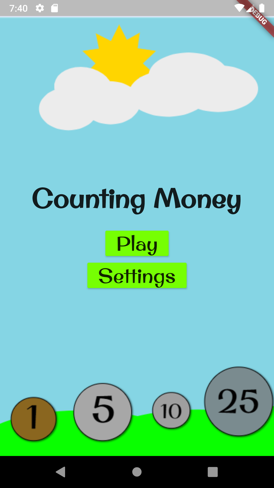

# Counting Coins

This Flutter application helps teach children how to count money in a fun and interactive way.
Users will learn the cost of US coins and there corresponding monetary values. There are also interactive exercises to help reinforce the concepts learned through the application.

